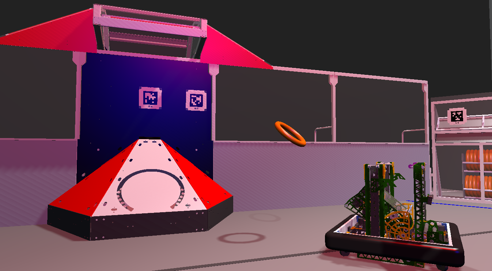

[`src/main/java/frc/robot`](src/main/java/frc/robot) shortcut

____

# _**The Patribots (FRC 4738)**_
### Visit our website at [patribots.org](https://www.patribots.org)!

 The Patribots are a school-based _FIRST&reg; Robotics Competition_ team from Patrick Henry High School, located in San Diego, California. 

This repository is entirely student-created and maintained.
Attached to this repository is a GitHub project called [Crescendo 2024](<https://github.com/orgs/Patribots4738/projects/3>) in which we utilize as the Agile framework to organize our workflow. With Agile, we map out the season by dividing it into many week long sprints. As a team, we agree upon & decide what must be accomplished in each sprint. We declare each assignment by making issues and then implement it in an associated branch. An estimated priority & size are assigned to each issue/assignment which is then filtered into five categories:
  - **Backlog** -> Issues that have no status. Essentially a large to-do list.
  - **Ready** -> Issues that are assigned to a programmer & are ready to begin.
  - **In Progress** -> Issues that are currently being worked on by a programmer.
  - **In Review** -> Issues where the assigned programmer has requested revision by colleagues.
  - **Done** -> Resolved issues with corresponding branches which have merged into our master branch called [`main`](https://github.com/Patribots4738/Crescendo2024/tree/main/src/main).

We also love [drawing boards](<https://www.tldraw.com/r/EolJKYU3QEqxw71uyAqPS?viewport=5486,-1359,3403,1540&page=page:9NTiPVa29oqzjElya5D6n>)!
    
We are a team of students, for students, and we are proud to be a part of the _FIRST&reg;_ community.
Thanks for checking us out, & be sure to star this repository if you find anything helpful or interesting!

### [See how we did!](https://www.statbotics.io/team/4738)

___

## ✨ Highlights ✨
  obj detection
on-the-fly autonomous decisions & pathfinding
color sensor oriented piece control
shooting while driving
fully simulated bobot
amp, speaker, stage auto alignment
log replay w/ AdvantageScope
automatic shooter startup
  
  
  
  
  - Object detection on Limelight --
  - Automatic shooter startup
  - Shooting while driving
  - Fully simulated robot, mechanisms, and motors
  - Auto alignment to amp, speaker, stage, and source
  - Color sensor oriented piece control
  - Log replay using Advantage Scope
  - Modular autonomous routines
  - April Tag interpretation on Limelight --
  - Field-centric swerve drive
  - Under bumper intake

## Simulation & Testing 🪄
  > It is crucial to maintain both our robot & our code. Therefore, we always run our code in a simulation using `FRC Driver Station` / `WPILibs's Sim GUI` and `Advantage Scope` to catch breaking changes on our robot before they happen in real life. After our design team has constructed the CAD model of our robot in `Onshape`, we can export its moving parts into `Advantage Scope`. We then link the CAD and the code together to simulate a robot that moves similarly to a real one. Once our code passes this unit test (working in simulation), we can expect a much more specific result on the real robot. This process is used with most of our code and was essential for code involving critical math (i.e. auto alignment & shooting while driving).
 
###  Note Trajectory
> A physics simulation that makes a realistic arc for the note inside of simulation. Supports a "realData" boolean which will shoot either a high note or a real note, so that we can visualize both at the same time to see if the robot expected to miss when it shot. This was incredibly useful for testing things like shooting while driving because we could see if the note was both expected go to in and arcing realistically.
###  PID Tuning w/ Network Tables
> When tuning PID, shooter speeds, and pivot angle, we can change the values in Advantage Scopes network tables. This allows us to dynamically change the values without redeploying our code constantly, making tuning faster, easier, and more accurate.
  
## Safe Spark 🛟
  > REV's motor controllers do not always set the parameter first try, causing our motor to break randomly. To keep our motors, our matches, our ranking, and our money safe, we made a class called Safe Spark! Safe Spark constantly checks whether the motor has correctly set its parameters. If no parameters were set, it returns a REVLibError type of `kError` and tries to set the parameter again. It will repeat this until it recognizes that the parameter has been received and implemented, finally returning a REVLibError type of kOK!

##  Swerve Drive 🛞

###  Field Centric
> To make the robot more user-friendly for the driver, our swerve drive is field-centric using our `Pigeon 2.0` gyroscope to get our orientation on the field.
  
###   Defensive X-Pose
> When our robot is stationary in teleop, we set the position of our wheels to an X. In this X-pose, our robot will stay stationary, even if another robot drives into us at full speed. This idea was first mentioned to us by [3255 - SuperNURDS](<https://github.com/FRCTeam3255>) and has helped us tremendously!

###   Discretize
> Our robot uses `REV MAX Swerve`. It works great, but when turning while driving, a dt of 0.02s just isn't small enough to get precise movement that doesn't drift. To remedy this, we discretize our speeds over 0.02s to get a new trajectory that results in the robot being able to spin while driving without drifting left or right. This is critical to our autonomous, since we need our position to be as accurate as possible. You can learn more about the evolution about it here: [Swerve Drive Skew and Second Order Kinematics - Chief Delphi](<https://www.chiefdelphi.com/t/whitepaper-swerve-drive-skew-and-second-order-kinematics/416964/33>). This code is now implemented into WPILib!

###   Wheel Characterization
> Calculating our odometry is based on the radius of our wheels, which changes throughout the season as the tread wears out. With the `Pigeon 2.0`, and inspiration from [6328 - Mechanical Advantage](<https://github.com/Mechanical-Advantage>), we can measure when one full turn of the robot has been completed, then use the distance traveled by each wheel to find the wheels' radius, helping us maintain the accuracy of our odometry.

## Autonomous 🤖
  
  
  ###   Path Generation & Modular Autonomous Paths 
  > We use `PathPlanner` to construct a modular autonomous. In `PathPlanner`, we use named waypoints, scheduled commands, & bezier curves to generate a singular auto path between a starting position, preferable shooting position, or note location. We then link multiple auto paths together to make one predetermined autonomous. Using note detection & logic, we are able to make quick decisions on whether or not we got the note, or if we should skip trying to get a note that isn't there. Additionally, there is no predetermined starting position when starting a chain of autonomous paths. This year's abundance of April tags allow us to generate a path from anywhere in the starting zone as long as our Limelight has a clear view of a tag. Feel free to check out our [Modular Auto Drawing Board](<https://www.tldraw.com/v/mBaJ6QzdW6wNaRUvmB3DW?viewport=-121,-188,2715,1378&page=page:page>) :>
    

  ###   Note Detection
  > Using `Limelight`'s machine learning algorithm accelerated by a `Google Coral`, we can detect notes from ~13 feet away. Note detection is incorporated in our modular autonomous logic, allowing the robot to hone in on a note and intake it by itself by using path generation and a holonomic drive controller. This is especially useful when to robot is at the center line where path generation without vision can become inaccurate, preventing notes from bumping off of a swerve module. Additionally, we can skip over a spike if no note is detected, helping us cut off the faster robots on the other alliance. Those opposing robots are fast!

  > Here is a GIF of Terry detecting a note and chasing it! 🦖🔎
  > 

## Teleoperated 🎮
  

###    Joystick Axis Remapping
 > We use Xbox controllers to control the robot. However, the range of the joystick axis from the Xbox controller is the shape of a skewed square with chamfered edges which is preferable for usage. In PatriBoxController, we remapped the range of input to a circle that is easier to use. Here's our [desmos](https://www.desmos.com/calculator/e07raajzh5) if you want to check out the math!
  
###   Shooting While Driving 
> Our robot is able to shoot notes into the speaker while moving! This feature grants us a shorter cycle time and is most evident in autonomous. Shooting while driving uses the real and simulated values of [`noteTrajectory`](src/main/java/frc/robot/commands/logging/NoteTrajectory). If you are curious to learn more, visit our section dedicated to note trajectory in _Simulation and Testing_ or check out the [math](<https://www.tldraw.com/v/mBaJ6QzdW6wNaRUvmB3DW? viewport=-121,-188,2715,1378&page=page:page>) behind it!

###   Auto Alignment w/ April Tags
> Another feature for user-friendliness is our robot's ability to align to field objects such as the speaker, stage & amp. When aligned to the speaker, the driver can move the robot anywhere on the field whilst the shooter always faces the speaker. For the amp & stage, the robot becomes locked in a certain axis. This helps the driver with steering & alignment.

###   Timed Event Triggers
> When certain time-relative or sequential events occur, it triggers another command or event. Some examples include:
  > - Doing a gradual rumble of the driver and operator controllers in endgame that gets more intense as the match timer gets closer to ending.
  > - Flashing `Limelight` LEDs and rumbling both controllers when our `REV Color Sensor V3` detects that we have a note
  > - Rumbling controllers when our shooter is up to speed or when aligned to the amp.

_____

## Major Class Functions 🤩

Our code is formatted in a <ins>command-based</ins> system on VS Code using <ins>Java<ins/>.
 
  ###   Subsystems
  > [`robot/subsystems`](src/main/java/frc/robot/subsystems) Folder containing class files for each subsystem on the robot.
  > - **Intake** [`robot/subsystems/intake`](src/main/java/frc/robot/subsystems/intake) An under-the-bumper intake run by a `Neo 550`.
  > - **Swerve** [`robot/subsystems/swerve`](src/main/java/frc/robot/subsystems/swerve) Drivetrain with four swerve modules using 4 `Neo Vortex`s and 4 `Neo 550`s.
  > - **Shooter** [`robot/subsystems/shooter`](src/main/java/frc/robot/subsystems/shooter) A shooter that uses 2 `Neo Vortexs` & pivot which uses 1 `Neo 550` with an absolute encoder.
  > - **Elevator** [`robot/subsystems/elevator`](src/main/java/frc/robot/subsystems/elevator) Elevator for amp & trap placement which uses 1 `Neo v1.1`.
  > - **Indexer** [`robot/subsystems/indexer`](src/main/java/frc/robot/subsystems/indexer) The Indexer between intake & shooter which uses a `Neo 550`.
  > - **Climb** [`robot/subsystems/climb`](src/main/java/frc/robot/subsystems/climb) Two independently driven climbs that conform to the curve of the unoccupied chain on stage to keep the robot level with the ground. Uses one `Neo Vortex` each.
  > - **LEDS** [`robot/subsystems/limelight`](src/main/java/frc/robot/subsystems/leds) Our `WS2812B` LED strip.
  > - **Limelight** [`robot/subsystems/limelight`](src/main/java/frc/robot/subsystems/limelight) Interaction between the `Limelight` (2 and 3) and the robot.
      

###   Commands
> [`robot/commands`](src/main/java/frc/robot/commands) Folder containing command files that control the robot.
> - **Alignment Commands** [`robot/commands/drive/alignmentCmds`](src/main/frc/robot/commands/drive/alignmentCmds) File of commands that help auto-align the robot to be locked on a certain axis when relative to a field object such as the stage or amp. This helps the driver with steering & alignment.
> - **Network Table PID Tuner** [`robot/commands/logging/NTPIDTuner`](src/main/frc/robot/commands/logging/NTPIDTuner) Command file that allows us to alter & tune the PID values via `Advantage Scope`'s Network Tables Tuner for ease of access.
> - **Selective Conditional Command** [`robot/commands/managers/SelectiveConditionalCommand`](src/main/frc/robot/commands/managers/SelectiveConditionalCommand) Command that is similar to `Commands.either` but instead of just checking the boolean when the Command is originally run, it constantly checks the boolean supplier and runs the correct command.
> - **Piece Control** [`robot/commands/manager/PieceControl`](src/main/robot/commands/manager/PieceControl) Command file containing various other commands that subsystems use to manage possession over the game piece.
>    - **getAutomaticShooterSpeeds** This is the default command for the shooter subsystem. It brings the shooter up to speed whenever the robot is in our alliance's wing and we have note possession to make the process of intaking, indexing, and then shooting significantly faster
 
 ###   Utilities
> [`robot/util`](src/main/java/frc/robot/util) Folder containing values, logic, and math used by other files to help them function.
> - **Constants** [`robot/util/constants`](src/main/java/frc/robot/util/constants) contains constants used throughout the robot code to prevent a mismatch in data & hardcoding values (Ex. PIDFF values & current limits).
> - **Calc** [`robot/util/calc`](src/main/java/frc/robot/util/calc) contains the calculations required for pivot alinment & shooter speeds when shooting while driving.
> - **Auto** [`robot/util/auto`](src/main/java/frc/robot/util/auto) Folder containing the storage files for `Choreo` and `PathPlanner`.
   
## Controls 🎮

## Components & Tools 🛠️

  

